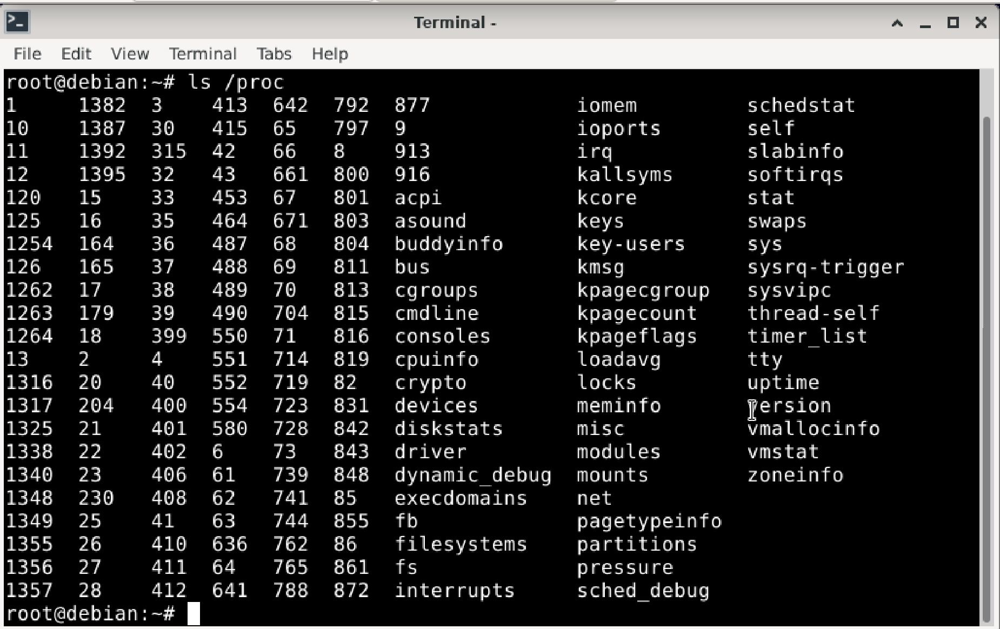
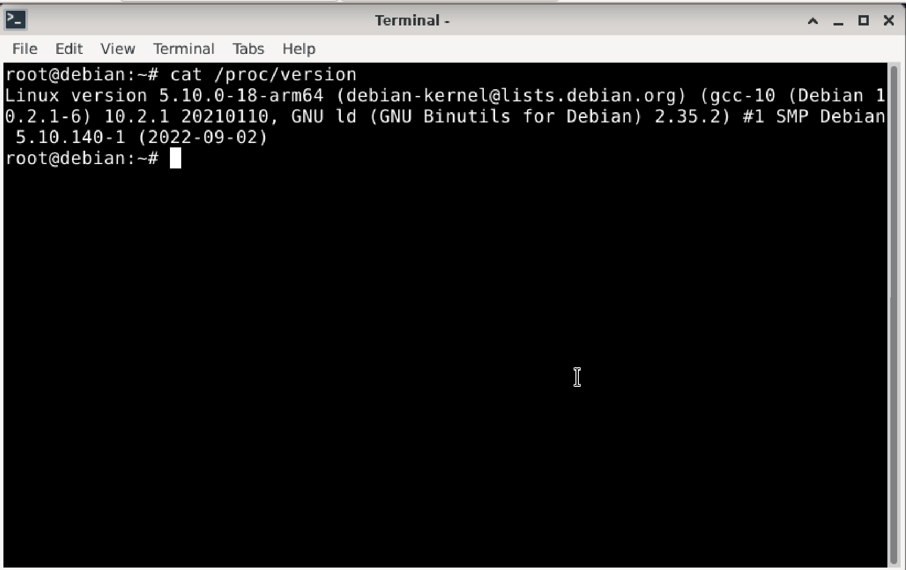
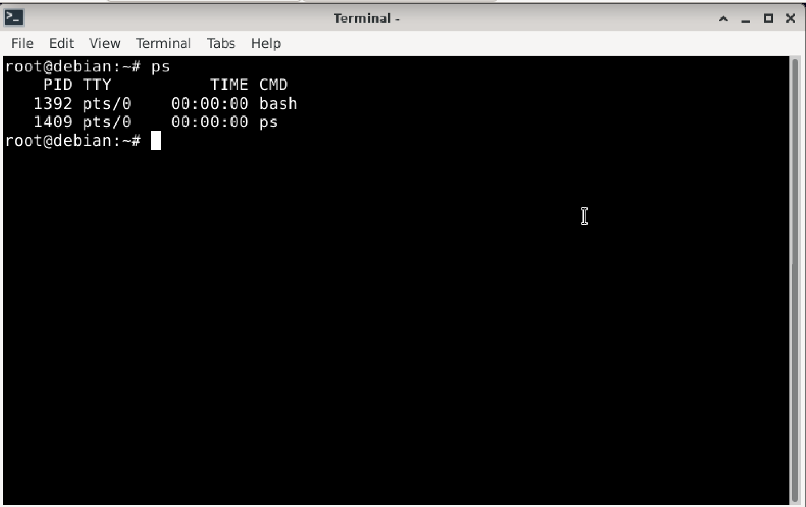
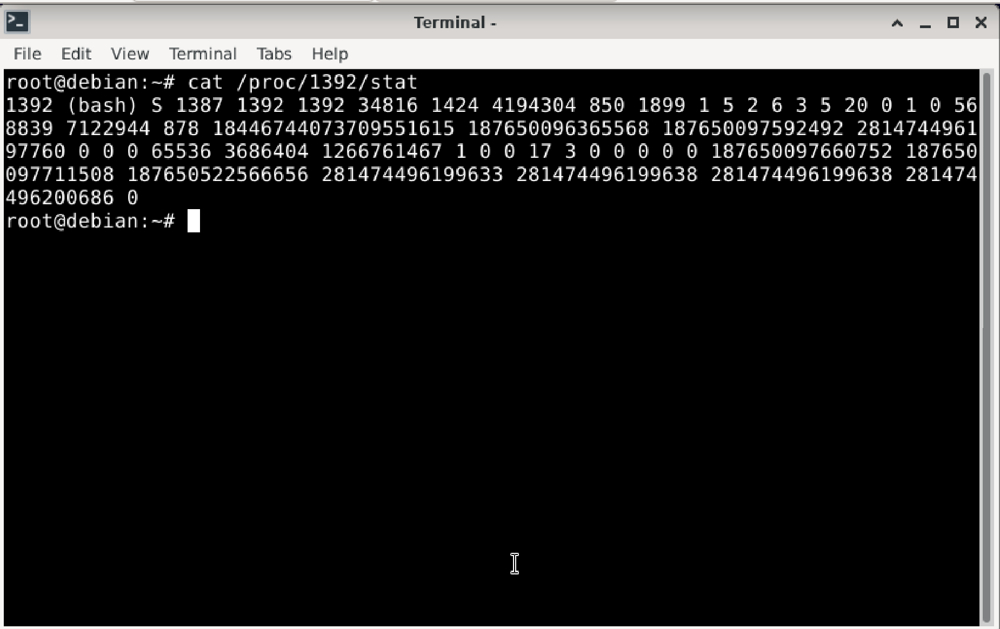
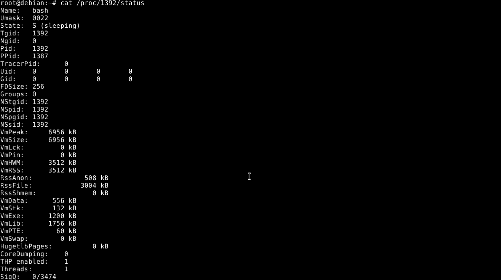
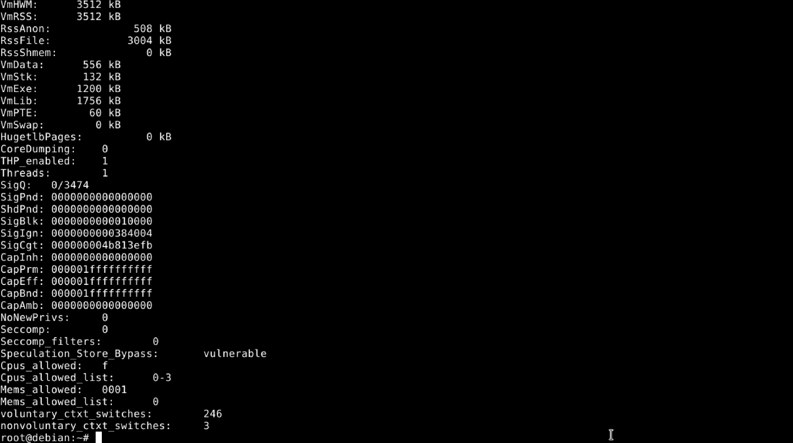
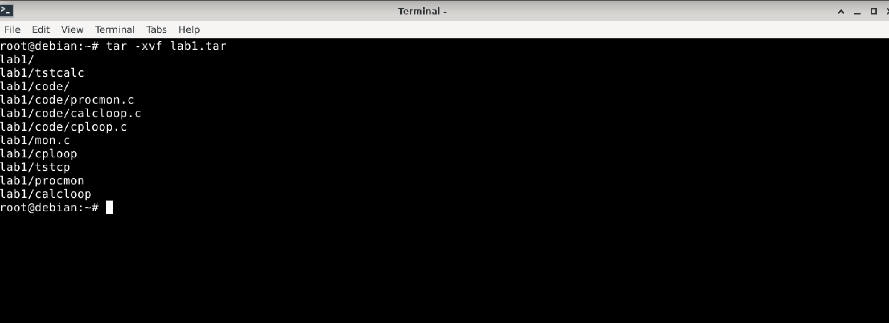

Absolutely, Faiz — here’s your cleaned-up and consistently formatted **Lab 1 Report** so far, written clearly in simple language, structured for submission, and ready to keep building on:

---

# **CSI3131 Lab 1 Report: Observing Process Behaviour**

**Name:** Faiz Mustansar
**Student ID:** 
**Date:** May 22nd, 2025

---

## ✅ Step 2: Exploring the `/proc` Filesystem

### 🔧 Command Used:

```bash
ls /proc
```

### 📸 Screenshot:



### 🧠 What I Observed:

* The `/proc` directory contained many folders with just numbers like `1`, `10`, `1382`, etc. These represent the **PIDs** (Process IDs) of currently running programs.
* It also had named entries like `cpuinfo`, `version`, `meminfo`, and more. These files contain real-time system information such as CPU details and kernel version.
* The files in `/proc` are **not real files** stored on the hard drive. They are **virtual files** generated by the Linux kernel to show the current state of the system.
---

## ✅ Step 3: Viewing Kernel Version

### 🔧 Command Used:

```bash
cat /proc/version
```

### 📸 Screenshot:



### 🧠 What I Observed:

```
Linux version 5.10.0-18-arm64 (debian-kernel@lists.debian.org) (gcc-10 (Debian 10.2.1-6) 10.2.1 20210110, GNU ld (GNU Binutils for Debian) 2.35.2) #1 SMP Debian 5.10.140-1 (2022-09-02)
```

* The system is running **Debian Linux** with **kernel version 5.10.0-18**.
* It's using the **ARM 64-bit architecture**.
* The kernel was last built on **September 2, 2022**, using GCC version 10.2.1.

---

## ✅ Step 4: Finding the Shell Process

### 🔧 Command Used:

```bash
ps
```

### 📸 Screenshot:



### 🧠 What I Observed:

* The `ps` command listed two processes:

  * `bash` with PID **1392** (my shell process)
  * `ps` with PID **1409** (the command I just ran)
* This confirms that my terminal session is currently running under **process ID 1392**.

---

Perfect, Faiz — you’ve completed both `/proc/1392/stat` and `/proc/1392/status`. Here's how that fits into your lab report, all formatted neatly:

---

## ✅ Step 5: Looking at Shell Process Info

### 🔧 Commands Used:

```bash
cat /proc/1392/stat
cat /proc/1392/status
```

### 📸 Screenshots:

* 
* 
* 

### 🧠 What I Observed:

#### `/proc/1392/stat`

This file contains one long line of space-separated values that describe the process. Key values include:

* **PID:** 1392
* **Process name:** `(bash)`
* **State:** `S` → Sleeping
* **PPID:** 1387 (Parent process ID)
* **utime/stime:** These are the user and system time values, which show how much CPU time the process has used.

To fully understand the fields, I referred to `man proc`. The stat file is useful for tracking how long the process has run and what state it's in.

---

#### `/proc/1392/status`

This file is more human-readable. Some important values I noted:

* **Name:** bash
* **State:** S (Sleeping)
* **Pid:** 1392
* **PPid:** 1387
* **Threads:** 1
* **VmSize:** 6956 kB (total memory used)
* **VmRSS:** 3512 kB (resident memory)
* **voluntary\_ctxt\_switches:** 246
* **nonvoluntary\_ctxt\_switches:** 3

This shows the process is sleeping (waiting for input), only using a small amount of memory, and has done a few context switches — most of them voluntary.

---

## ✅ Step 6: Extracting and Reviewing Files

### 🔧 Command Used:

```bash
tar -xvf lab1.tar
```

### 📸 Screenshots:



### 📁 Files Extracted:

* **`calcloop`**: A program that simulates a CPU-bound task. It does calculations in a loop after sleeping for 3 seconds.
* **`cploop`**: A program that simulates an I/O-bound task. It copies a file in a loop after a short delay.
* **`procmon`**: A process monitor that checks `/proc/[PID]/stat` once per second and prints the state, user time, and system time of the target process.
* **`tstcalc`**: A shell script or program that runs `calcloop` and monitors it using `procmon`.
* **`tstcp`**: A script or program that runs `cploop` and monitors it using `procmon`.
* **`mon.c`**: A C file you will later modify or complete. It should automatically launch both the target and monitor programs and handle stopping them.

---
