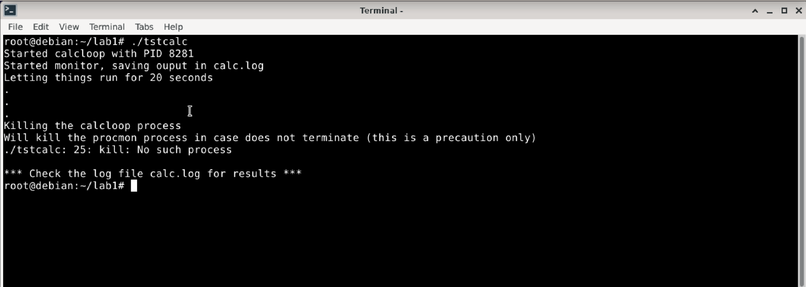
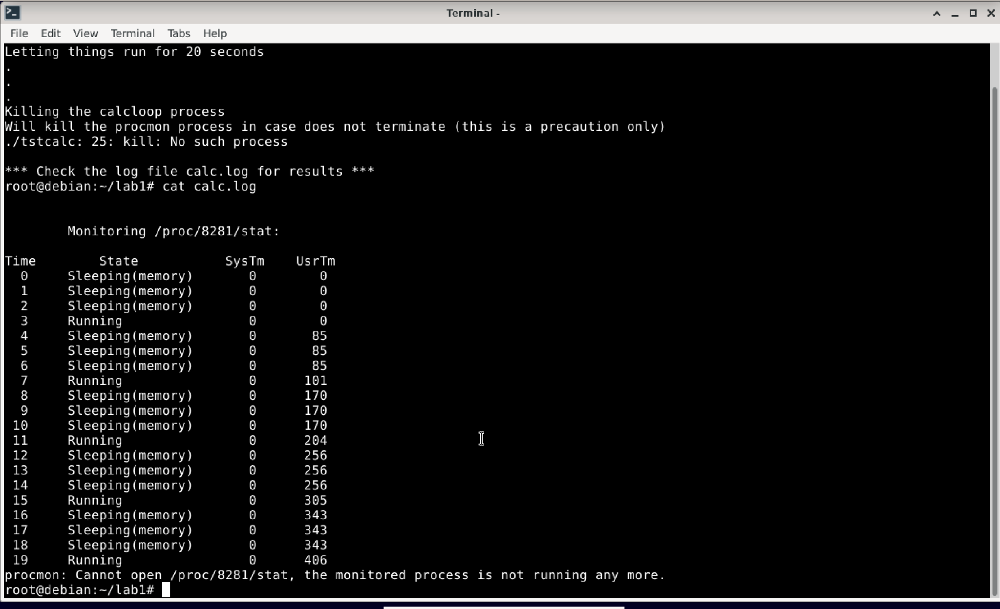
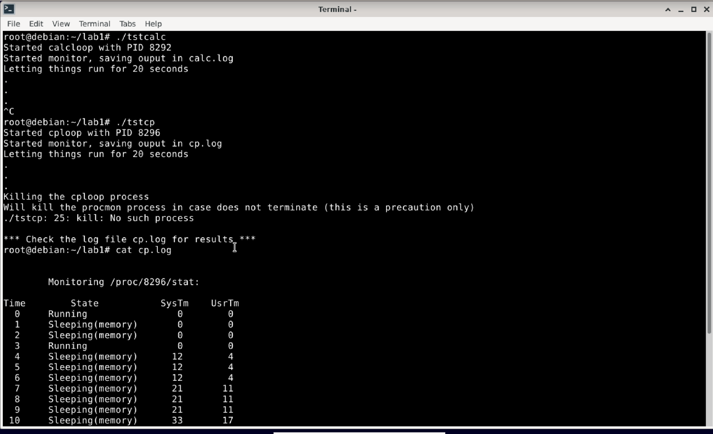
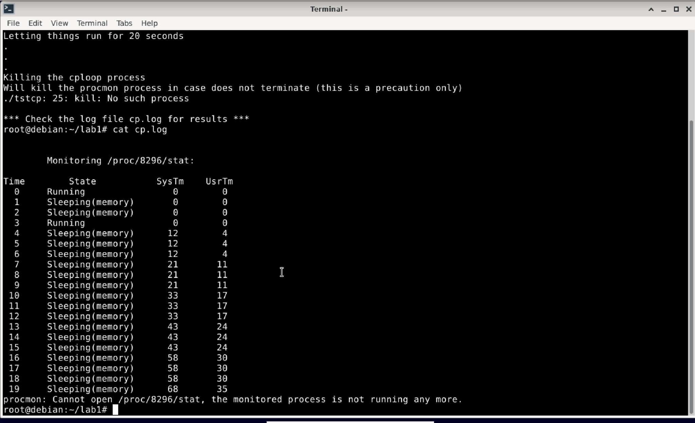
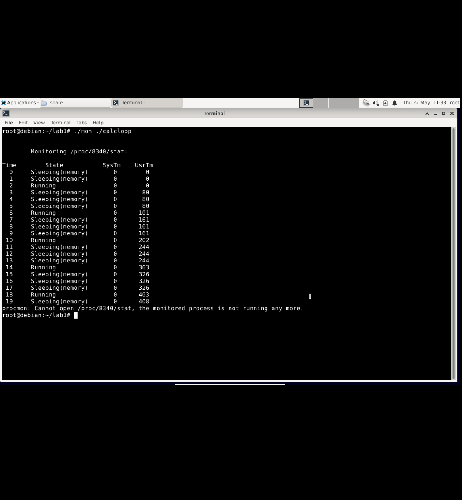

# **CSI3131 Lab 1 Report: Observing Process Behaviour**

- **Name:** Faiz Mustansar
- **Student ID:** 300506752
- **Date:** May 22, 2025

---

## Step 2: Exploring the `/proc` Filesystem

### Command Used:

```bash
ls /proc
```

### Screenshot:


### Observations:

* The `/proc` directory contained many folders with numeric names such as `1`, `10`, and `1382`. These represent the Process IDs (PIDs) of currently running processes.
* It also contained named entries such as `cpuinfo`, `version`, and `meminfo`, which provide real-time system information including CPU details and kernel version.
* These files are not stored on the hard drive but are virtual files generated by the Linux kernel, dynamically reflecting the current state of the system.

---

## Step 3: Viewing Kernel Version

### Command Used:

```bash
cat /proc/version
```

### Screenshot:


### Observations:

```
Linux version 5.10.0-18-arm64 (debian-kernel@lists.debian.org) (gcc-10 (Debian 10.2.1-6) 10.2.1 20210110, GNU ld (GNU Binutils for Debian) 2.35.2) #1 SMP Debian 5.10.140-1 (2022-09-02)
```

* The system is running Debian Linux with kernel version 5.10.0-18.
* It is based on the ARM 64-bit architecture.
* The kernel was built on September 2, 2022, using GCC version 10.2.1.

---

## Step 4: Finding the Shell Process

### Command Used:

```bash
ps
```

### Screenshot:


### Observations:

* The output showed two processes:

  * `bash` with PID 1392, which represents the current shell session.
  * `ps` with PID 1409, which is the command just executed.
* This confirms that the shell is running under process ID 1392.

---

## Step 5: Looking at Shell Process Information

### Commands Used:

```bash
cat /proc/1392/stat
cat /proc/1392/status
```

### Screenshots:

* 
* 
* 

### Observations:

#### `/proc/1392/stat`

* This file provides a long, space-separated string with key values including:

  * PID: 1392
  * Process name: `(bash)`
  * State: `S` (Sleeping)
  * Parent PID: 1387
  * `utime` and `stime` represent the CPU time spent in user and system mode, respectively.

#### `/proc/1392/status`

* A human-readable format providing:

  * Process name: bash
  * State: Sleeping
  * PID and PPID: 1392 and 1387
  * Threads: 1
  * VmSize: 6956 kB
  * VmRSS: 3512 kB
  * Voluntary context switches: 246
  * Nonvoluntary context switches: 3

These values confirm the process is sleeping, using minimal memory, and has experienced more voluntary than involuntary context switches.

---

## Step 6: Extracting and Reviewing Files

### Command Used:

```bash
tar -xvf lab1.tar
```

### Screenshot:


### Files Extracted:

* `calcloop`: Simulates a CPU-bound task.
* `cploop`: Simulates an I/O-bound task.
* `procmon`: Monitors a process by reading from `/proc/[PID]/stat`.
* `tstcalc`: Launches `calcloop` and monitors it.
* `tstcp`: Launches `cploop` and monitors it.
* `mon.c`: A C program designed to replicate the shell scripts using system calls.

---

## Step 7: Running the Programs and Analyzing Logs

### Commands Used:

```bash
./tstcalc
cat calc.log
./tstcp
cat cp.log
```

### Screenshots:

* `tstcalc`:

  * 
  * 
* `tstcp`:

  * 
  * 

### Observations:

#### `calc.log` – CPU-bound Process (`calcloop`)

* The process alternated between sleeping and running states.
* User time (`UsrTm`) steadily increased, indicating heavy computation.
* System time (`SysTm`) remained close to zero, confirming minimal kernel interaction.

#### `cp.log` – I/O-bound Process (`cploop`)

* The process spent significant time in the sleeping state, specifically memory sleep.
* Both user and system times increased very slowly.
* This indicates the process was frequently waiting on I/O operations and performing little direct computation.

---

## Step 9–11: Running `mon.c` to Launch and Monitor a Program Automatically

### Command Used:

```bash
./mon ./calcloop
```

### Screenshot:



### Observations:

* The `mon` program successfully launched `calcloop` and passed its PID to `procmon`.
* `procmon` monitored the process by reading `/proc/[PID]/stat` once per second.
* The output showed transitions between the running and sleeping states, and a gradual increase in user time.
* After 20 seconds, `mon.c` terminated both the `calcloop` and `procmon` processes as expected.

## Conclusion

This lab helped me understand how Linux keeps track of programs that are running on the system. I learned how to use the `/proc` folder to find information about each process, like how much CPU or memory it is using, and whether it is currently running or sleeping.

By testing the two programs, `calcloop` and `cploop`, I saw the difference between a program that mostly uses the CPU (doing lots of calculations) and one that mostly waits for input/output (like copying files). `calcloop` used more CPU time, while `cploop` spent more time waiting.

Writing the `mon.c` program taught me how to start a process in C, monitor it, and stop it when needed. I used system calls like `fork()`, `exec()`, and `kill()`, which are important tools for working with processes in C.

Overall, this lab gave me hands-on experience with how Linux handles running programs, and it helped me better understand how system resources are used by different types of tasks.

Certainly, Faiz. Below is your **formal CSI3131 Lab 1 Report** with all emojis removed, a professional tone maintained throughout, and image placeholders properly retained:

---