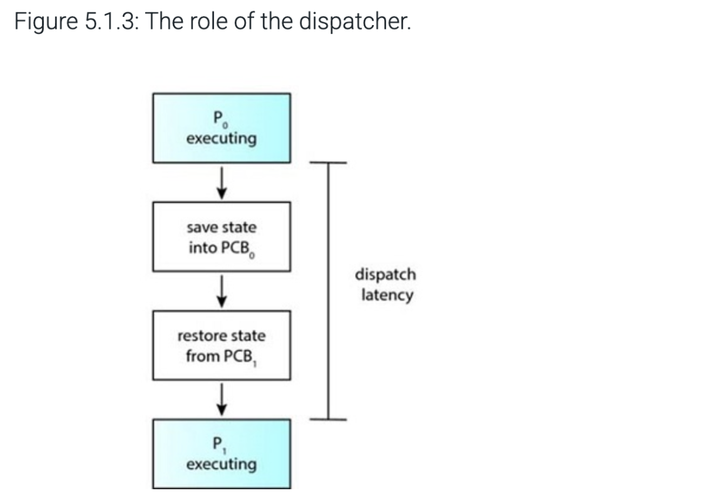

# Table of Content

1. [Chapter One](#chapter-one-introduction-to-operating-systems)
2. [Chapter Two](#chapter-two-operating-system-structure)
3. [Chapter Three](#chapter-three-processes)
4. [Chapter Four](#chapter-four-threads-and-concurrency)
5. [Chapter Five](#chapter-five-cpu-scheduling)
6. [Chapter Six](#chapter-six-synchronization-tools)
6. [Chapter Seven](#chapter-six-synchronization-examples)

# **Chapter One: Introduction to Operating Systems**

## What is an Operating System?

An **Operating System (OS)** is a program that serves as an intermediary between the user and the computer hardware.

### Main Goals of an OS:

- Execute user programs and assist with solving problems.
- Provide a convenient and user-friendly environment.
- Utilize hardware resources efficiently.
- Ensure good performance and ease of use.

### Key Definitions:

- The **kernel** is the core component of the OS and is *“the one program always running.”*
- Everything else is classified as:
    - **System programs**: Included with the OS (e.g., file managers, compilers).
    - **Application programs**: Used to perform specific user tasks (e.g., web browsers).

---

## Components of a Computer System

A modern computer system is divided into four components:

1. **Hardware** – The physical components: CPU, memory, and I/O devices.
2. **Operating System** – Manages hardware and coordinates resources.
3. **Application Programs** – Software that solves user problems (e.g., spreadsheets, compilers).
4. **Users** – End users, machines, or other systems.

---

## System Initialization

### Bootstrap Program:

- Loaded during power-up or reboot.
- Stored in **firmware** (e.g., ROM or EPROM).
- Initializes hardware and loads the **OS kernel** into memory to start execution.

---

## System Operation and Interrupts

### CPU and I/O Interaction:

- CPU and I/O devices share a **system bus** to access **shared memory**.
- Each **device controller** manages a specific hardware device and contains a **local buffer**.
- The CPU moves data between main memory and these buffers.

### Interrupts:

- Devices inform the CPU that an operation has completed via **interrupts**.
- The **interrupt vector** maps to specific service routines.
- A **trap** or **exception** is a software-generated interrupt (e.g., caused by a divide-by-zero error or a system call).
- The operating system is **interrupt-driven**.

### Types of Interrupts:

- **Polling** – The CPU checks each device regularly (inefficient).
- **Vectored** – The device sends a specific interrupt signal to the CPU (more efficient).

### Dual-Mode Operation:

- **User Mode**: Limited access; used for executing user applications.
- **Kernel Mode**: Full access; used by the OS for critical operations.
- Mode transitions protect system integrity and prevent user programs from interfering with the OS.
- Switching from user to kernel mode occurs during a **system call** or **exception**, and returns to user mode once the task is handled.

---

## Performance Optimization

### Caching:

- Frequently accessed data is copied to **faster memory** (cache) to improve performance.
- Main memory (RAM) often serves as a cache for secondary storage (e.g., hard drives).

### Device Drivers:

- Each device controller uses a **device driver** to communicate with the OS.
- Drivers provide a **uniform interface**, abstracting hardware-specific details.

---

## System Architectures

### Multiprocessor Systems:

- Also called **parallel systems** or **tightly-coupled systems**.
- Contain two or more CPUs working together.
- Benefits include:
    - Increased reliability (fault tolerance).
    - Cost efficiency (economy of scale).
    - Higher throughput and performance.

### Types:

- **Asymmetric Multiprocessing**: Each processor performs a specific task.
- **Symmetric Multiprocessing**: All processors perform all tasks equally.

---

## Clustered Systems

Clustered systems consist of multiple computers connected together to function as a unified system.

### Key Features:

- Share storage through a **Storage Area Network (SAN)**.
- Provide **high availability**, continuing operation even if one system fails.

### Types of Clustering:

- **Asymmetric Clustering**: One node is in standby mode, ready to take over on failure.
- **Symmetric Clustering**: All nodes are active and monitor each other.

### High-Performance Computing (HPC):

- Used in scientific or complex tasks requiring high processing power.
- Applications must be written to support **parallelization**.

### Distributed Lock Manager (DLM):

- Prevents conflicting operations by managing resource access across clustered systems.

---

## Interrupt Handling Overview

| Type | Description |
| --- | --- |
| Hardware | Triggered by physical devices (e.g., keyboard, disk I/O). |
| Software | Triggered by exceptions or system calls during execution. |

The system transitions from **user mode** to **kernel mode** to safely handle these interrupts and system requests

---

## **Operating System Structure**

- **Multiprogramming**: Keeps the CPU busy by having multiple jobs (programs) in memory. When one job needs to wait (like for input), the OS switches to another job.
- **Timesharing (Multitasking)**: The OS quickly switches between jobs so users can interact with each one as if it's running alone.
- Each user has at least one **process** in memory.
- If memory is full, the OS swaps processes in and out (called **swapping**).
- **Virtual memory** allows running programs that don’t fully fit in RAM by moving parts in and out of memory.

---

## **Operating System Operations**

- OS is **interrupt-driven**:
    - **Hardware interrupts**: from devices like a keyboard or disk.
    - **Software interrupts (traps)**: from errors or user requests.
- **Dual-mode operation**:
    - **User mode**: limited access (regular apps).
    - **Kernel mode**: full access (OS-level).
    - Mode bit helps the OS know which mode it's in.
    - Some instructions are only allowed in kernel mode for safety.

---

## **Timer**

- Used to **prevent programs from running forever** (infinite loop).
- The OS sets a countdown (timer), and when it reaches zero, an interrupt is triggered so the OS can take control again.

---

## **Process Management**

- A **process** is a program that's running.
- A program (like a file) is inactive, but a process is active.
- It needs resources: memory, CPU time, input/output, etc.
- When a process ends, the OS takes back the resources.
- **Single-threaded** process: one task at a time.
- **Multi-threaded**: can do multiple things at once.
- Multiple processes can run at the same time using **CPU scheduling**.

### Key OS responsibilities:

- Start and end processes.
- Pause and continue processes.
- Help processes **talk to each other** and avoid **conflicts** (deadlocks).

---

## **Memory Management**

- Programs and data must be in memory (RAM) to run.
- The OS decides:
    - What should be in memory.
    - When to move things in or out.
    - Who gets how much memory.
- Goal: keep memory use efficient and responsive.

---

## **Storage Management**

- OS presents a logical view of storage as **files**.
- Manages devices like hard drives and SSDs.
- Files are usually in **directories** (folders).
- Handles:
    - Creating/deleting files.
    - Reading/writing files.
    - Controlling who can access what.
    - Backups to keep files safe.

---

## **Mass Storage Management**

- For long-term storage (data that doesn’t fit in memory).
- Uses **disks** for storing large amounts of data.
- The OS handles:
    - Managing free space.
    - Deciding where to store files.
    - **Scheduling** disk access to avoid delays.

---

## **I/O Subsystem**

- The OS hides hardware complexity from users.
- Uses:
    - **Buffering**: store data temporarily.
    - **Caching**: save frequent data for faster access.
    - **Spooling**: run input/output tasks in the background.
- Uses **device drivers** to talk to hardware.

---

## **Protection and Security**

- **Protection**: Controls what each program/user can access.
- **Security**: Defends the system against threats like viruses or hackers.
- Each user has a unique ID. Files and processes are tagged with these IDs to control access.
- **Groups** allow shared access rights.
- **Privilege escalation** lets certain users do more (like an admin).

---

## **Kernel Data Structures**

The OS uses data structures to manage resources:

- **Linked lists** (singly, doubly, circular)
- **Binary trees** (regular and balanced for faster search)
- **Hash tables** for fast lookups
- **Bitmaps** to track which resources are in use

---

## **Computing Environments**

### 1. **Traditional**

- Regular PCs or laptops.
- Connected to networks like the Internet.
- May include firewalls or portals for access.

### 2. **Mobile**

- Smartphones and tablets.
- Added features like GPS, sensors, etc.
- Run mobile OSes like iOS or Android.

### 3. **Distributed**

- A group of computers connected over a network.
- Work together and look like a single system.
- Communicate using **TCP/IP** (Internet protocol).

### 4. **Client-Server**

- Clients (like your browser) request services from servers.
- Server types:
    - **Compute server**: handles tasks like databases.
    - **File server**: stores and shares files.

### 5. **Peer-to-Peer (P2P)**

- No fixed server or client.
- All nodes (devices) are equal.
- Examples: Skype, file-sharing apps like BitTorrent.

### 6. **Virtualization**

- Run multiple OSes on one computer.
- Example: Running Windows inside macOS.
- Uses **Virtual Machine Managers (VMM)** like VirtualBox or VMware.

### 7. **Cloud Computing**

- Offers services over the Internet:
    - **SaaS** (Software): Google Docs.
    - **PaaS** (Platform): Firebase.
    - **IaaS** (Infrastructure): AWS storage.
- Can be **public**, **private**, or **hybrid** clouds.
- Needs extra security (like firewalls) and tools (like load balancers).

### 8. **Real-Time Embedded Systems**

- Computers built into devices (cars, microwaves, etc.).
- Some run real-time operating systems (RTOS) where tasks must finish on time.
- Example: An airbag must trigger exactly when needed.

---

## **Open-Source Operating Systems**

- Anyone can see and change the code.
- Encourages freedom and learning.
- Examples: Linux, BSD (base of macOS).
- Tools like VirtualBox let you run these OSes for testing and exploration.

---

# **Chapter Two: Operating System Structure**

## Operating System Services

An **Operating System (OS)** provides the environment in which programs run. It offers services to both users and the system. These services fall into two main categories:

### 1. Services for Users and Programs

These services make it easier and safer to run applications.

**User Interface (UI)**

- Most operating systems provide a **Graphical User Interface (GUI)** using windows, icons, and a mouse.
- A **Command-Line Interface (CLI)** allows users to type in commands directly.
- **Touch-screen interfaces** are common on mobile devices and allow input through gestures.
- Many systems offer two or all three types of interfaces.

**Program Execution**

- The OS must:
    - Load programs into memory
    - Execute them
    - Terminate them either normally (successful execution) or abnormally (due to an error)

**I/O Operations**

- Programs often need to interact with input/output devices such as disks, printers, or networks.
- For efficiency and security, users do not directly control devices.
- The OS provides controlled access to these resources.

**File-System Manipulation**

- Programs and users may:
    - Read, write, create, and delete files and directories
    - Search for files and list their information
    - Set or manage permissions to control access
- Many systems support multiple file systems for performance or compatibility.

**Communication Between Processes**

Two main methods are used:

- **Shared Memory**: Processes read and write to the same area of memory.
- **Message Passing**: Information is packaged and transferred between processes by the OS.

These methods support communication between processes on the same system or across a network.

**Error Detection**

- The OS constantly monitors for errors in:
    - Hardware (e.g., memory or disk issues)
    - I/O devices (e.g., printer or network errors)
    - Programs (e.g., illegal memory access, divide-by-zero)
- Depending on the error, the OS may shut down a process, return an error code, or take corrective action.

---

### 2. Services for System Management and Efficiency

These services focus on managing resources and ensuring system reliability.

**Resource Allocation**

- When multiple programs run at the same time, the OS allocates CPU time, memory, storage, and I/O devices.
- Special routines (e.g., CPU scheduling) determine how resources are assigned.

**Accounting (Logging)**

- Tracks resource usage by each program or user.
- Useful for:
    - System performance analysis
    - Billing in multi-user environments
    - System configuration and planning

**Protection and Security**

- Ensures that processes do not interfere with each other or the OS.
- Includes:
    - **Authentication**: Users must prove their identity (e.g., with a password).
    - **Authorization**: Control over what each user or process can access.
    - **Security**: Protects the system from external threats or unauthorized access.

a view of operating system services

Operating systems offer different ways for users to interact with them. There are **three main types of interfaces**:

---

### 1. **Command-Line Interface (CLI)**

- Also called a **command interpreter** or **shell**.
- Lets users type commands directly.
- Common in systems like **Linux, UNIX, and Windows**.
- Examples of shells: **C shell, Bash (Bourne-Again shell), Korn shell**.

### How it works:

- Some commands are **built into the shell**, meaning the shell knows what to do.
- Others use **system programs**. The shell simply **runs a file** with the command's logic (e.g., `rm file.txt` runs the `rm` program).
- This design makes it **easy to add new commands** without changing the shell itself.

### 2. **Graphical User Interface (GUI)**

- Uses **windows, icons, and menus** instead of typing.
- Users click on **icons** or **folders** using a mouse.
- Common in operating systems like **macOS, Windows, and Linux** with GUIs like **GNOME and KDE**.
- Originated from research at **Xerox PARC** in the 1970s and became popular with the **Apple Macintosh** in the 1980s.
- GUIs are more **visual and beginner-friendly**.

### 3. **Touch-Screen Interface**

- Used in **smartphones and tablets**.
- Users interact by **tapping, swiping, or pinching** the screen.
- Replaces the need for physical keyboards or mice.
- Example: **iPhone and iPad use the Springboard interface**.

## **Choosing an Interface**

- **Power users** and **system administrators** prefer the **command-line** because it’s faster and supports **automation** through **shell scripts** (saved command steps).
- **Most everyday users** prefer **GUIs** because they’re easier and more visual.
- Some tasks are only available via CLI, especially on UNIX/Linux systems.
- **macOS now supports both**: the Aqua GUI and a command line (because it’s built on a UNIX kernel).
- **Mobile systems** rarely use command lines—almost everything is done through **touch**.

## System Calls

System calls are how a **program communicates with the operating system (OS)** to request services like reading a file, creating a new process, or writing to the screen. They form the **interface between a running program and the OS kernel**.

System calls are usually accessed through **functions in high-level languages** like C or C++. Low-level tasks might require **assembly language**.

Mostly accessed by programs via a high-level **Application Programming Interface (API)** rather than direct system call use

---

## Real-World Example: Copying a File

A simple program that copies one file to another uses **multiple system calls**, including:

- Reading input/output file names (e.g., through user input or GUI)
- Opening files (error checks needed)
- Reading from the input file
- Writing to the output file
- Handling errors (e.g., file not found, disk full)
- Closing files and exiting

Even this simple task shows how **heavily programs rely on system calls**.

---

## Application Programming Interface (API)

- Most programmers don’t directly write system calls.
- Instead, they use **APIs** like:
    - **Win32 API** (Windows)
    - **POSIX API** (Linux/macOS)
    - **Java API** (for JVM programs)

APIs **abstract away system call details**, making programs more portable and easier to write. Internally, APIs **call system functions** behind the scenes.

**Example:**

`printf()` → calls `write()` system call via the **C standard library (libc)**

---

## How System Calls Work

System calls go through a **system-call interface**, which:

1. Passes the request from user mode to kernel mode.
2. Uses a **system call number** to find the correct function in the system call table.
3. Executes the function in kernel mode and returns results.

---

## Parameter Passing

System calls often need input parameters. There are three main ways to pass them:

1. **Registers** – Fastest but limited to a few parameters.
2. **Memory block/table** – A structure with parameters; passed via register. Used by Linux.
3. **Stack** – Parameters are pushed onto the stack.

---

## Major Categories of System Calls

| **Category** | **Common System Calls** |
| --- | --- |
| **Process Control** | `create_process()`, `exit()`, `fork()`, `exec()` |
| **File Management** | `open()`, `read()`, `write()`, `close()` |
| **Device Management** | `request_device()`, `release_device()`, `ioctl()` |
| **Information Maintenance** | `get_time()`, `set_time()`, `get_system_info()` |
| **Communications** | `send_message()`, `receive_message()`, `pipe()`, `mmap()` |
| **Protection** | `get_permissions()`, `set_permissions()`, `allow_user()` |

---

## Examples: Windows vs UNIX System Calls

| **Action** | **Windows** | **UNIX/Linux** |
| --- | --- | --- |
| Create process | `CreateProcess()` | `fork()`, `exec()` |
| Read file | `ReadFile()` | `read()` |
| Set permissions | `SetFileSecurity()` | `chmod()` |

---

## Interprocess Communication (IPC)

**Two models:**

1. **Message Passing**
    - Processes exchange messages.
    - Good for small data transfers.
    - Easier for distributed systems (e.g., over a network).
2. **Shared Memory**
    - Processes access the same memory area.
    - Fastest method but needs synchronization (e.g., using locks).

Common system calls:

- `open_connection()`, `accept_connection()`
- `shared_memory_create()`, `shared_memory_attach()`

---

## Device and File Management

- OS treats physical devices and files similarly.
- Common calls: `read()`, `write()`, `open()`, `close()`
- Devices might require exclusive access via `request_device()` and `release_device()`.

---

## Debugging and Maintenance

- System calls like `dump_memory()` and tools like `strace` help track system call usage.
- Time profiling and logging help optimize performance.

---

## Special Platforms

**Arduino (Single-tasking):**

- Uses a bootloader, no OS.
- Only one program (sketch) runs at a time.

**FreeBSD (Multitasking):**

- Uses `fork()` and `exec()` to run multiple programs at once.
- Allows background processes, priority control, and shell interaction.

--- 

## **Linkers and Loaders**

- **Compiler**: Turns source into object (.o) files.
- **Linker**: Combines object files into an **executable**.
- **Loader**: Loads executable into **memory** and prepares it for execution.
- **Relocation**: Adjusts memory addresses during linking/loading.
- **Dynamically Linked Libraries (DLLs)**: Linked at runtime, not baked into the executable (saves memory).
- **File formats**:
    - Linux/UNIX: **ELF**
    - Windows: **PE**
    - macOS: **Mach-O**

---

## **Why Applications Are OS-Specific**

- **Compiled apps don’t run on other OSs** due to:
    - Different system calls.
    - Different binary formats and CPU instruction sets.
- **Cross-platform solutions**:
    1. **Interpreted languages** (Python, Ruby).
    2. **Virtual machines** (Java).
    3. **Porting** code to other OSs using standard APIs like POSIX.

---

## **OS Design and Implementation**

- **Design goals**:
    - User goals: easy, safe, reliable.
    - System goals: efficient, flexible, maintainable.
- **Mechanism vs Policy**:
    - **Mechanism**: How to do something.
    - **Policy**: What to do.
    - Separating them = more flexibility (microkernels prefer this).
- **Implementation**:
    - Most OSs use **C/C++**, not assembly.
    - Assembly is used only for **critical low-level parts**.
    - Modular design helps with debugging and maintenance.

---

## **OS Structure**

- **Monolithic**: Everything in one big kernel (fast, but complex).
- **Layered**: Built in layers (bottom = hardware, top = UI).
- **Microkernel**: Strips kernel to basics; rest runs in user space (more secure, but slower).
- **Modules (LKMs)**: Dynamically loaded pieces of kernel code (used by Linux).
- **Hybrid**: Mix of structures (e.g., Windows, macOS).
    - macOS = Darwin kernel = Mach microkernel + BSD UNIX.
    - Android = Linux kernel + custom libraries + ART VM.

---

## **Booting the OS**

- **Booting** = starting the OS.
- **Bootstrap program (bootloader)**: Loads the kernel (e.g., GRUB).
- **BIOS vs UEFI**:
    - UEFI is newer, faster, supports bigger drives.
- Linux uses **initramfs** as a temp root file system during boot.
- Final step: start system process like `systemd` (Linux) or `init` (Android).

---

## **Debugging**

- **Debugging** = finding and fixing errors (bugs).
- **Crash**: When kernel fails.
- **Core dump**: Snapshot of memory during crash for analysis.
- **Tools**:
    - **Counters**: `top`, `vmstat`, `/proc` files.
    - **Tracers**: `strace`, `gdb`, `perf`, `tcpdump`.
- **BCC (BPF Compiler Collection)**:
    - Used for **live system tracing** on Linux.
    - Based on **eBPF**, a lightweight, safe, fast way to trace.
    - Written in Python with embedded C.
    - Example: `opensnoop -p 1225` traces open() calls by a specific process.

# Chapter Three: Processes

- **Process** is a program that is loaded into memory and executing   
- Computers can run multiple processes at once using multitasking  
- **Text section**—the executable code  
- **Data section**—global variables  
- **Heap section**—memory that is dynamically allocated during program run time  
- **Stack section**—temporary data storage when invoking functions (such as function parameters, return addresses, and local variables)  
- A program is **passive** such as a file containing a list of instructions stored on disk (**executable file)** where as a process is an **active** entity  
- Process state can be changed and it can be in one of the following states  
  - **New.** The process is being created.  
  - **Running.** Instructions are being executed.  
  - **Waiting.** The process is waiting for some event to occur (such as an I/O completion or reception of a signal).  
  - **Ready.** The process is waiting to be assigned to a processor.  
  - **Terminated.** The process has finished execution.  
- A **process control block (task control block)** contains the following:  
  - **Process state.** The state may be new, ready, running, waiting, halted, and so on.  
  - **Program counter.** The counter indicates the address of the next instruction to be executed for this process.  
  - **CPU registers.** The registers vary in number and type, depending on the computer architecture. They include accumulators, index registers, stack pointers, and general-purpose registers, plus any condition-code information. Along with the program counter, this state information must be saved when an interrupt occurs, to allow the process to be continued correctly afterward when it is rescheduled to run.  
  - **CPU-scheduling information.** This information includes a process priority, pointers to scheduling queues, and any other scheduling parameters. (Chapter CPU Scheduling describes process scheduling.)  
  - **Memory-management information.** This information may include such items as the value of the base and limit registers and the page tables, or the segment tables, depending on the memory system used by the operating system (Chapter Main Memory).  
  - **Accounting information.** This information includes the amount of CPU and real time used, time limits, account numbers, job or process numbers, and so on.  
  - **I/O status information.** This information includes the list of I/O devices allocated to the process, a list of open files, and so on.  
- A process usually has one **thread** but can have multiple (multi-threading)  
- The number of processes in memory \= **degree of multiprogramming.**  
- **Multiprogramming** keeps the CPU busy by having some process always running.  
- **Context switch** happens when CPU switches from one process to another:  
  - Saves current process state (registers, program counter, memory info) into PCB.  
  - Loads new process state from its PCB.  
  - Takes a few microseconds and is considered overhead.  
- A process can create **child processes,** forming a **tree**  
- Each process has unique **pID**  
- Use *fork()* to create a child, returns 0 to child, child’s pID to parent  
- Use *exec()* to load a new program in the child  
- Use *wait()* in parent to pause until child finishes   
- What best describes the return value from fork() to the parent process after the parent successfully creates a child process?  
  - fork() returns a positive value to the parent process, representing the actual pid of the child process.  
- **zombie**: A process that has terminated but whose parent has not yet called wait() to collect its state and accounting information.  
- **orphan**: The child of a parent process that terminates in a system that does not require a terminating parent to cause its children to be terminated.  
- A process is **independent** if it does not share data with other processes occuring in the system  
- A process is **cooperating** if it can affect or be affected by other processes executing in the system  
  - Requires **interprocess communication (IPC)** that will allow them to exchange the data  
- There are **2** fundamental models of IPC:   
  - **Shared memory**  
    - A region of memory that is shared by the cooperating processes is established, processes can then exchange info by reading the writing to the shared region  
    - One process creates a shared memory region where the other processes attach it to their memory space  
    - They can read/write directly bypassing the OS and they must make sure that they don't write at the same time  
    - ***producer***: A process role in which the process produces information that is consumed by a consumer process.  
    - ***consumer***: A process role in which the process consumes information produced by a producer process.  
    - ***unbounded buffer***: A buffer with no practical limit on its memory size.  
    - ***bounded buffer***: A buffer with a fixed size.  
  - **Message passing**  
    - Communication takes place by means of messages exchanged between the cooperating processes  
    - **Message passing** \= processes communicate by sending and receiving messages.  
    - **Synchronous** \= both sender and receiver wait (block) until the message is delivered.  
    - **Rendezvous** \= the point where both sender and receiver meet during blocking communication.

- The ***browser*** process is responsible for managing the user interface as well as disk and network I/O. A new browser process is created when Chrome is started. Only one browser process is created.  
- ***Renderer*** processes contain logic for rendering web pages. Thus, they contain the logic for handling HTML, Javascript, images, and so forth. As a general rule, a new renderer process is created for each website opened in a new tab, and so several renderer processes may be active at the same time.  
- A ***plug-in*** process is created for each type of plug-in or Chrome extension in use. Plug-in processes contain the code for the plug-in as well as additional code that enables the plug-in to communicate with associated renderer processes and the browser process.  
- Client server communication can use   
  - **Sockets** (low level)  
    - A socket is a communication endpoint where each connection is unique: pair of sockets   
    - Consists of **IP address** and **port number**  
    - Connections must be unique  
    - Java provides 3 different types of sockets:  
      - **Connection Oriented (TCP)**   
      - **Connectionless (UDP)**  
    - **Port** is a number at the start of a message packet  
    -   
  - **Remote procedure calls (RPCs)** higher level

# Chapter Four: Threads and Concurrency 

- A **thread** is a basic unit of CPU utilization; it consists of thread ID, PC, a register set and a stack. Threads can share code, data and OS resources   
- A process can have one or more threads  
- Benefits of multithreaded programming:  
  - **Responsiveness**: app stays usable even during long tasks  
  - **Resource Sharing**: threads in same process share memory and resources easily   
  - **Economy**: creating threads uses less memory and time than creating new processes   
  - **Scalability** : threads can run in parallel on multiple cores, improving performance   
- **Multicore:** multiple processing cores within the same CPU Chip or within a single system  
- **Concurrency:** supports more than one task by allowing all the tasks to make progress  
- **Parallelism:** can perform more than one task simultaneously. There are two types of them  
  - **Task parallelism**   
    - Distributing data but not threads/tasks across multiple computing cores. Each thread is performing a unique operation and different threads may be operating on the same data or different data  
  - **Data parallelism**  
    - Focus on distributing subsets of the same data across multiple computing cores and performing the same operation on each core

![][image1]

- 5 challenges of multicore programming  
  - **Identifying tasks** – figure out which parts of a program can be separated and run independently.  
  - **Balancing tasks** – make sure tasks are equally useful and balanced in workload.  
  - **Splitting data** – divide data properly so different threads can work on different parts.  
  - **Data dependency** – make sure threads don’t mess each other up if they share data.  
  - **Testing/debugging** – much harder with parallel programs due to many possible paths.  
- **user thread**: A thread running in user mode.  
- **kernel threads**: Threads running in kernel mode.  
- Multithreading models:  
  - **Many to one**  
    - Many user threads → 1 kernel thread  
    - Only ONE thread can run at a time  
    - Blocking system calls stop all threads  
    - Not suitable for multicore systems  
    - Rarely used today  
  - **One To One**  
    - Each user thread → 1 kernel thread  
    - Allows true parallelism on multicore systems  
    - Can run another thread if one is blocked  
    - Too many threads can cause system overhead  
    - Used by linux and windows  
  - **Many To Many**  
    - Many user threads → some (or equal) kernel threads.  
    - Allows parallelism and more flexibility.  
    - Developers can create many threads.  
    - Kernel chooses which ones to run.  
    - **Hard to implement** so less common in practice  
- **Two-Level Model**  
  - A mix of many-to-many and one-to-one.  
  - Some user threads are **bound** to kernel threads (like one-to-one).  
  - Others share kernel threads (like many-to-many).  
- **Thread library:** provides the programmer with an API for creating and managing threads. There are two ways of implementing it:  
  - Provide a library in user space entirely with no kernel support. All code and data structure for the library exist in user space. Invoking a function in the library results in a local function call in user space and not a system call  
  - Implement a kernel-level library supported directly by the operating system. . In this case, code and data structures for the library exist in kernel space. Invoking a function in the API for the library typically results in a system call to the kernel.  
- Three main thread libraries today: POSIX Pthreads, Windows and Java  
- **implicit threading**: A programming model that transfers the creation and management of threading from application developers to compilers and run-time libraries.  
- **thread pool**: A number of threads created at process startup and placed in a pool, where they sit and wait for work.  
- **fork-join**: A strategy for thread creation in which the main parent thread creates (forks) one or more child threads and then waits for the children to terminate and join with it.  
- **parallel regions**: Blocks of code that may run in parallel.  
- **dispatch queue**: An Apple OS feature for parallelizing code; blocks are placed in the queue by Grand Central Dispatcher (GCD) and removed to be run by an available thread.  
- **main queue**: Apple OS per-process block queue.  
- **user-interactive**: In the Grand Central Dispatch Apple OS scheduler, the scheduling class represents tasks that interact with the user.  
- **user-initiated**: In the Grand Central Dispatch Apple OS scheduler, the scheduling class represents tasks that interact with the user but need longer processing times than user-interactive tasks.  
- **utility**: In the Grand Central Dispatch Apple OS scheduler, the scheduling class represents tasks that require a longer time to complete but do not demand immediate results.  
- **background**: Describes a process or thread that is not currently interactive (has no interactive input directed to it), such as one not currently being used by a user. In the Grand Central Dispatch Apple OS scheduler, the scheduling class represents tasks that are not time sensitive and are not visible to the user.  
- **block**: A self-contained unit of work. The smallest physical storage device storage unit, typically 512B or 4KB. In the Grand Central Dispatch Apple OS scheduler, a language extension that allows designation of a section of code that can be submitted to dispatch queues.  
- **iteration space**: In Intel threading building blocks, the range of elements that will be iterated.  
- **fork():**   
  - Can duplicated only the calling threads or  
  - All threads  
- **exec():**  
  - Replaces the entire process, wiping out all threads  
- A **signal** is used in UNIX systems to notify a process that a particular event has occurred. It may be received either synchronous or asynchronous depending on the source and the reason for the event being signaled  
- A signal may be **handled** by one of the two possible handers:	  
  - **A default signal handler**  
    - Kernel runs when handling that signal. This action can be overridden by **user-defined signal handler** that is called to handle the signal  
  - **A user-defined signal handler**  
- Terminating a running application using a keystroke sequence causes an **asynchronous** exception  
- **Thread cancellation** involves terminating a thread before it has completed. A thread that is to be cancelled is often referred to as the **target thread**. It may occur in two different scenarios:  
  - **Asynchronous cancellation:** one thread immediately terminates the target thread  
  - **Deferred cancellation:** the target thread periodically checks whether it should terminate, allowing it an opportunity to terminate itself in an orderly fashion  
- Cancellation points are associated with **deferred** cancellation  
- **Thread-Local Storage (TLS):** Allows each thread to maintain its own copy of data (e.g., unique IDs). 

# Chapter Five: CPU Scheduling

- **CPU** scheduling is a fundamental OS function that improves CPU utilization by switching processes  
- In **single-core systems,** one process runs at a time whereas in **multicore systems.** Multiple processes can run concurrently on different cores  
- CPU-I/O Burst Cycle processes alternate between:   
  - CPU bursts (e.g., calculations)  → few long CPU bursts  
  - I/O bursts (e.g., disk access)→ many short CPU bursts CPU-bound programs  
- **nonpreemptive**: Under nonpreemptive scheduling, once a core has been allocated to a thread the thread keeps the core until it releases the core either by terminating or by switching to the waiting state.  
- **cooperative**: A form of scheduling in which threads voluntarily move from the running state.  
- **preemptive**: A form of scheduling in which processes or threads are involuntarily moved from the running state (by for example a timer signaling the kernel to allow the next thread to run).  
- **Dispatcher** is a module that gives control of the CPU’s core to the process selected by the CPU scheduler. This function involves the following:	  
  - Switching context from one process to another  
  - Switching to user mode  
  - Jumping to the pripoer location in the user program to resume that program  
  - The time it takes for the dispatcher to stop one process and start another running is known as **dispatch latency**

- Majority of the criteria for comparing CPU-scheulding algorithms are:  
  - **CPU Utilization**  
    - Goal: Keep CPU as busy as possible.  
    - Ideal range: 40%–90%.  
    - Measured using tools like `top` (Linux/macOS/UNIX).  
- **Throughput**  
  - Number of processes completed per unit of time.  
  - Long processes → low throughput  
  - Short processes → high throughput

- **Turnaround Time**  
  - Total time from process submission to completion.  
  - Includes: waiting time \+ execution time \+ I/O time  
- **Waiting Time**  
  - Time spent **only** in the ready queue.  
  - Affected directly by the scheduling algorithm.  
- **Response Time**  
  - Time from request submission to the **first response**.  
  - Critical in interactive systems (e.g., desktop apps).  
    Focuses on how quickly the system **starts** responding.  
- CPU-scheduling algorithm is the **first-come, first-served (FCFS)** scheduling algorithm. With this scheme, the process requests the CPU.   
  - it’s non preemptive.  
  - Simple and easy to implement but it has poor average waiting time if long jobs arrive first, causes **convoy effect** (long processes delay short ones) and it is not ideal for interactive systems  
- **shortest job first (SJF)**  
  - Process with the shortest next CPU burst is chosen.   
  - Type: Non-preemptive or Preemptive (**Shortest Remaining Time First or SRTF**)  
  - Pros: Minimizes average waiting time (optimal).   
  - Cons: Can't perfectly predict the next CPU burst. Requires estimation (usually via exponential averaging).  
- **Round-robin scheduling**  
  - Order: Like FCFS but with preemption using a time quantum.   
  - Type: Preemptive.   
  - Pros: Fair for all processes. Ideal for interactive systems.   
  - Cons: Performance highly dependent on time quantum size.   
    - Too small → too many context switches.   
    - Too large → behaves like FCFS.  
- **Priority-scheduling algorithm**  
  - Order: CPU goes to the process with the highest priority.   
  - Type: Can be preemptive or non-preemptive.   
  - Special Case: SJF is a priority algorithm where priority \= 1/burst time.   
  - Cons:   
    - Can cause **starvation** (**indefinite blocking**).   
    - Solution: **Aging** (increase priority over time).

- **Multilevel queue**  
  - Idea: Multiple ready queues (e.g., foreground, background) with different priorities.   
  - Static: A process stays in its assigned queue.   
  - Scheduling between queues:   
    - Fixed priority  
    - Time-sliced among queues

- **Multilevel feedback queue scheduling**  
  - Most flexible algorithm.   
  - Processes can move between queues based on behavior.   
  - Key idea: Favor short (I/O-bound) jobs and demote long (CPU-bound) jobs.   
  - Uses **aging** and **different time quantums** for each level.   
  - Pros:   
    - Dynamic, prevents starvation.   
    - Adapts to varying job types.   
- Cons: Most complex to implement and tune.  
- There is one distinction between user level and kernel level threads in terms of how they are scheduled  
  - User-level threads are scheduled by the thread library using **process-contention scope (PCS)**, meaning they compete for the CPU only with other threads within the same process. In contrast, kernel-level threads are scheduled by the operating system using **system-contention scope (SCS)**, meaning they compete for the CPU with all other threads across the entire system..   
- **process-contention scope (PCS):** On systems implementing the many-to-one and many-to-many threading models, the thread library schedules user-level threads to run on an available LWP (and thus threads contend with others within the same process contend for CPU time).   
- **system-contention scope (SCS):** A thread scheduling method in which kernel-level threads are scheduled onto a CPU, regardless of which process they are associated with (and thus contending with all other threads on the system for CPU time).  
- If multiple CPUs are available, **load sharing,** where multiple threads may run in parallel. Becomes possible, however scheduling issues become correspondingly more complex  
- **Multiprocessor** referred to systems that provided multiple physical processors where each processors contained one single-core CPU   
- **asymmetric multiprocessing** is simple because only one core accesses the system data structures, reducing the need for data sharing  
- **Symmetric Multiprocessing (SMP)** – All processors are self-scheduling. Most modern OSes use this.  
- Queue Organization:   
  - **Shared Queue** – All processors pick from one queue (can cause bottlenecks).  
  - **Private Queues** – Each processor has its own queue (more efficient, avoids race conditions).  
- Two ways to multithread a processing core:  
  - **Coarse-grained:** only switches thread on long stalls  
  - **Fine-grained:** switches thread every cycle (more responsive)   
- Only one thread may run in parallel on a single processing core with 2 hardware threads  
- **Load balancing:** attempts to keep the workload evenly distributed across all processors in an SMPT system. There are two approaches to load balancing  
  - **Push migration:** a specific task periodically checks the load on each processor and if it finds the imbalance,  it will evenly distributes the load by pushing threads from overloaded to less busy processors  
  - **Pull migration:** occurs when an idle processor pulls a waiting task from processor  
  - Push and pull migration need not be mutually exclusive and often implemented in parallel on load-balancing systems  
- **processor affinity**: A kernel scheduling method in which a process has an affinity for the processor in which it is currently running (to keep the cache warm for example).   
- **soft affinity**: When an operating system has a policy of attempting to keep a process running on the same processor—but not guaranteeing that it will do so. hard affinity: When an operating system supports or allows a process's threads to run on the same processor at all times (as opposed to being moved to various processors as the thread is scheduled onto CPU).  
- **soft real-time systems**: Soft real-time systems provide no guarantee as to when a critical real-time thread will be scheduled \- they guarantee only that the thread will be given preference over noncritical threads  
- **hard real-time systems**: Hard real-time systems have strict scheduling facilities \- a thread must be serviced by its deadline and service after the deadline has expired is the same as no service at all.  
- **event latency**: The amount of time that elapses from when an event occurs to when it is serviced.  
- There are two types of latencies that affects the performance of real-time systems:  
  - **Interrupt latency**: The period of time from the arrival of an interrupt at the CPU to the start of the routine that services the interrupt.

- **dispatch latency**: The amount of time the dispatcher takes to stop one thread and put another thread onto the CPU.  
- **conflict phase**: During scheduling, the time the dispatcher spends moving a thread off of a CPU and releasing resources held but lower-priority threads that are needed by the higher-priority thread that is about to be put onto CPU.  
- **periodic**: A type of real-time process that repeatedly moves between two modes at fixed intervals- needing CPU time and not needing CPU time.  
- **rate**: A periodic real-time process has a scheduling rate of 1 / p (where p is the length of its running period).  
- **admission-control**: In real-time scheduling, the scheduler may not allow a process to start if its scheduling request is impossible \- if it cannot guarantee that the task will be serviced by its deadline.  
- **rate-monotonic**: The rate-monotonic scheduling algorithm schedules periodic tasks using a static priority policy with preemption. CPU utilization is bounded when using this algoirthim   
- **Earliest-Deadline-First (EDF)**: A real-time scheduling algorithm in which the scheduler dynamically assigns priorities according to completion deadlines. The earlier the deadline, the higher the priority   
- **proportional share**: Proportional share schedulers operate by allocating 𝑇 shares among all applications assuring each gets a specific portion of CPU time.  
  
# Chapter Six: Synchronization Tools

- Operating systems often run many threads at once, either concurrently or in parallel  
  - These threads sometimes share the same data

- If shared data is accessed without control, it can cause incorrect results  
  - This issue is called a race condition  
    - Happens when two or more threads try to update the same variable at the same time  
    - The final result depends on the order in which instructions are run

- Example using a shared variable `count` in producer-consumer problem  
  - Producer does `count++` to add to the buffer  
    - Translated to: read `count`, add 1, write back
  - Consumer does `count--` to remove from the buffer  
    - Translated to: read `count`, subtract 1, write back
  - If both happen at the same time, their steps can overlap and overwrite each other  
    - This can lead to wrong values like 4 or 6 instead of the correct 5

- This shows why process synchronization is needed  
  - Ensures only one thread can access or update shared data at a time  
  - Prevents unexpected results caused by overlapping operations

- A **cooperating process** is one that can affect or be affected by other processes executing in the system. 
- a **race condiction** can occur when several threads try to access and modify the same data concurrently
- **coordination**: Ordering of the access to data by multiple threads or processes.
  - They may share the same code and data space, or communicate via shared memory or message passing

- **Critical-section problem** arises when multiple processes share and update the same data
  - Each process has a part of its code (**critical section**) that accesses shared data
  - Only one process can be in its critical section at a time
  - The section of code implementing this request is the **entry section** and the critial section can be followed by an **exit section**. The remaining code is the **remainder section**

- To manage access, code is divided into:
  - Entry section: asks for permission to enter the critical section
  - Critical section: modifies shared data
  - Exit section: releases control
  - Remainder section: rest of the code

- A correct solution to the problem must satisfy three conditions:
  - **Mutual exclusion**: only one process in the critical section at any time
  - **Progress**: if no one is in the critical section, the decision of who enters next cannot be delayed unnecessarily
  - **Bounded waiting**: a process won't wait forever to enter its critical section

- Example of race condition in kernel: managing a list of open files
  - If two processes open files at the same time, they may corrupt the list if not synchronized

- Another example: assigning process IDs using fork()
  - Two processes can end up getting the same ID if updates to `next_available_pid` are not protected

- Disabling interrupts can solve race conditions in single-core systems
  - Prevents context switching while modifying shared data
  - Not ideal for multiprocessor systems
    - Takes longer to broadcast interrupt disable signal
    - Can harm system performance

- Two types of kernel handling:
  - **Preemptive kernel**
    - Can switch out a process in kernel mode
    - More responsive
    - Better for real-time tasks
    - Needs careful design to avoid race conditions
  - **Nonpreemptive kernel**
    - Once in kernel mode, process cannot be interrupted
    - Naturally avoids race conditions
    - Might be less responsive if kernel code takes long to finish
    - kernel is free from race conditions

- **Peterson’s solution **is a software method for handling critical sections between two processes
- Uses **two** shared variables:
  - `flag[2]`: shows if a process wants to enter
  - `turn`: decides whose turn it is to enter
- Each process:
  - Sets its flag to true, sets turn to the other
  - Waits if the other wants to enter and it's their turn
  - Enters critical section once safe, then resets its flag
- Ensures:
  - Mutual exclusion (only one enters at a time)
  - Progress (one can enter if the other isn't interested)
  - Bounded waiting (fair access)
- Doesn't work reliably on modern CPUs due to instruction reordering
  - Reordered reads/writes can break mutual exclusion

- **Software-based** solutions (e.g., Peterson’s) don’t always work on modern CPUs due to instruction reordering
- Hardware offers support via:
  - **Memory barriers** (aka memory fences)
    - Prevent instruction reordering
    - Ensure all previous memory operations are completed before continuing
    - Used by kernel developers to avoid data inconsistencies
    - falls into one of two categories:
      1. **Strongly ordered**, where a memory modification on one processor is immediately visible to all other processors.
      2. **Weakly ordered**, where modifications to memory on one processor may not be immediately visible to other processors.
  - **Atomic instructions**:
    - `test_and_set()`:
      - Sets a lock and returns its old value
      - Used to implement basic mutual exclusion
    - `compare_and_swap()` (CAS):
      - Swaps value only if expected value matches
      - Used in mutual exclusion logic
  - CAS-based algorithms:
    - Simple version provides mutual exclusion but not bounded waiting
    - Bounded waiting version uses a `waiting[]` array to ensure fair turn-taking
- **Atomic variables**:
  - Built using atomic instructions like CAS
  - Used for safe updates (e.g., incrementing counters)
  - Good for simple race conditions but not full synchronization problems

- **memory model**: Computer architecture memory guarantee, usually either strongly ordered or weakly ordered.

- **memory barriers**: Computer instructions that force any changes in memory to be propagated to all other processors in the system.

- **memory fences**: Computer instructions that force any changes in memory to be propagated to all other processors in the system.

- **atomically**: A computer activity (such as a CPU instruction) that operates as one uninterruptable unit.

- **atomic variable**: A programming language construct that provides atomic operations on basic data types such as integers and booleans.

- **Mutex (mutual exclusion) locks** are high-level software tools to avoid race conditions
  - A process must **acquire()** the lock before the critical section and **release()** it after
  - Ensures only one thread enters the critical section at a time

- Mutex lock uses a boolean `available` flag
  - `acquire()` loops (busy wait) until lock is available, then sets it to false
  - `release()` sets the lock to true again

- Requires atomic operations to avoid race conditions during acquire/release
  - Often implemented using `compare_and_swap` (CAS)

- Issues with basic mutex:
  - Causes **busy waiting** (CPU cycles wasted)
  - Called a **spinlock (A locking mechanism that continuously uses the CPU while waiting for access to the lock.)** due to the constant checking loop
  - Useful if the lock is held for a **short duration** (less than two context switches)
  - Spinlocks are effective on **multi-core systems**, where one core can spin while another is in the critical section

- Locks can be:
  - **Contended**: when multiple threads try to acquire the lock (performance drops)
  - **Uncontended**: when the lock is immediately available

- **Semaphores** are integer variables used for synchronization, accessed only through two atomic operations:
- `wait(S)`: blocks if `S <= 0`; otherwise, decrements `S`
- `signal(S)`: increments `S`
- **Binary semaphore**: value is 0 or 1 (like a mutex lock)
- **Counting semaphore**: tracks multiple resource instances (value ≥ 0)
- Binary semaphores ensure mutual exclusion (e.g., critical sections)
- Counting semaphores control access to a limited number of resources
- Instead of looping, processes waiting on a semaphore are **put to sleep**
- `wait()` adds a process to a queue and suspends it
- `signal()` wakes up a waiting process
- `wait()` and `signal()` must be atomic to avoid race conditions
- In uniprocessor systems, this can be done by disabling interrupts
- In multiprocessors, techniques like `compare_and_swap` or spinlocks are used
- To use a binary semaphore to solve the critical section problem, the semaphore must be initialized to 1 and `wait()` must be called before entering a critical section and `signal()` must be called after exiting the critical section.

- High-level synchronization construct that ensures **mutual exclusion** automatically
- Only **one process** can be active in a monitor at a time
- Errors like race conditions can still happen if:
  - `wait()`/`signal()` are misused
  - Programmers ignore access rules

- **Monitor** = abstract data type (ADT)
  - represents programmer-defined data and a set of functions that provide mutual exclusion
  - Combines shared variables and functions to manipulate them
  - Functions are mutually exclusive by design
- Uses **condition variables** with:
  - `wait()` → process suspends until signaled
  - `signal()` → resumes one waiting process
- If `signal()` is called when no process is waiting → no effect
- Monitor implementations:
  - Often built using semaphores under the hood
  - Additional semaphores (`mutex`, `next`, etc.) help manage internal logic
- Supports **conditional wait** with priority numbers:
  - Resumes process with smallest priority number
- Limitations:
  - Can’t fully prevent misuse (e.g., a process accessing resource without monitor)
  - Still requires programmer discipline
  - Not ideal for large or dynamic systems without extra access control

- **Liveness** ensures that processes make progress in their execution
- **Liveness failure** occurs when processes wait indefinitely, harming performance
- **Deadlock**:
  - Happens when two or more processes wait on each other’s resources
  - No process can proceed because the required signal never occurs
- **Priority inversion**:
  - A high-priority process is blocked by a lower-priority one holding a needed resource
  - Becomes worse if the low-priority process gets preempted by a medium-priority process
  - Solved using **priority inheritance**, where the lower-priority process temporarily gets higher priority to finish and release the resource
- **priority-inheritance protocol:** A protocol for solving priority inversion in which all processes that are accessing resources needed by a higher-priority process inherit that higher priority until they are finished with the resources in question.
- **lock-free:** An algorithmic strategy that provides protection from race conditions without requiring the overhead of locking.

# Chapter Seven: Synchronization Examples

- These problems test synchronization tools like semaphores, mutexes, and monitors.
- **Bounded-Buffer Problem**
  - Shared buffer with `N` slots.
  - Uses 3 semaphores: 
    - `mutex` for mutual exclusion
    - `empty` (initially N) for empty slots
    - `full` (initially 0) for full slots
  - Producer: `wait(empty)`, `wait(mutex)`, `add item`, `signal(mutex)`, `signal(full)`
  - Consumer: `wait(full)`, `wait(mutex)`, `remove item`, `signal(mutex)`, `signal(empty)`

- **Readers-Writers Problem**
  - Multiple readers can access data simultaneously.
  - Writers need exclusive access.
  - Uses semaphores `rw_mutex`, `mutex`, and integer `read_count`.
  - *First problem: no reader should wait unless a writer is writing.*
  - Can lead to *starvation* (either readers or writers depending on variation).

- **Dining-Philosophers Problem**
  - Philosophers need 2 chopsticks (shared resources) to eat.
  - Simple solution using semaphores may cause deadlock if all pick one chopstick.
  - Remedies include:
    - Allow max 4 philosophers at a time.
    - Only pick up chopsticks if both are available.
    - Odd philosophers pick up left first, even pick up right first.
  - Monitor solution uses states (THINKING, HUNGRY, EATING) and condition variables.
  - Prevents deadlock but may still allow starvation.
- **dining-philosophers problem**: A classic synchronization problem in which multiple operators (philosophers) try to access multiple items (chopsticks) simultaneously.

- **Windows Kernel**
  - Uses spinlocks for global resources on multiprocessors (short duration).
  - Window provides **dispatcher objects** (mutexes, semaphores, events, timers) used for thread sync outside the kernel.
    - Objects can be in `signaled` (available) or `nonsignaled` (not available) state.
    - Threads block if object is nonsignaled; moved to ready when signaled.

  - **Critical-section objects** are user-mode mutexes with low overhead.
    - Uses spinlocks first; falls back to kernel mutex if contention is high.

- **Linux Kernel**
  - Fully preemptive (post v2.6).
  - **Atomic integers** (e.g., `atomic_t`) allow lock-free operations for counters.
  - **Mutex locks**: `mutex_lock()` and `mutex_unlock()` for critical sections.

  - **Spinlocks**: used for short-duration locks on SMP systems.
    - On single-core systems, kernel preemption is disabled/enabled instead.
  - `preempt_disable()` and `preempt_enable()` manage preemption.
    - Controlled by `preempt_count` counter in thread info.
    - If `preempt_count > 0`, kernel preemption is not allowed.
  - **Nonrecursive locks**: A thread must release a lock before reacquiring it.
  - Use semaphores or mutexes for long-duration locking.

- POSIX API provides user-level thread synchronization (used in UNIX/Linux/macOS).
- Tools: mutex locks, semaphores, condition variables (via Pthreads/POSIX SEM extension).

- **Mutex Locks**
  - Use `pthread_mutex_t`.
  - Init: `pthread_mutex_init(&mutex, NULL)`.
  - Lock: `pthread_mutex_lock(&mutex)`; unlock: `pthread_mutex_unlock(&mutex)`.
  - Used to protect critical sections.

- **POSIX Semaphores**
  - Two types: **named** and **unnamed**.

  - *Named Semaphores*
    - Created with `sem_open("name", O_CREAT, 0666, initial_value)`.
    - Shared across unrelated processes using name.
    - Use `sem_wait(sem)` and `sem_post(sem)` for access control.

  - *Unnamed Semaphores*
    - Created with `sem_init(&sem, 0, initial_value)`.
    - Shared only among threads in the same process (unless using shared memory).
    - Same wait/post functions as named semaphores.

- **Condition Variables**
  - Used with mutexes to wait for conditions.
  - Data types: `pthread_cond_t` and `pthread_mutex_t`.
  - Wait: 
    - Lock mutex
    - Check condition in loop
    - `pthread_cond_wait(&cond, &mutex)` (automatically unlocks mutex during wait)
  - Signal: 
    - `pthread_cond_signal(&cond)` (does not release mutex)
    - Followed by `pthread_mutex_unlock(&mutex)`
  - Helps avoid race conditions by waiting for specific changes in shared data.

- Java provides built-in synchronization through monitors and additional mechanisms since Java 1.5
- Every object has a lock and a wait set for managing thread access

- `synchronized` keyword
  - Used to define methods or blocks that require owning an object’s lock
  - Threads wait in the **entry set** if the lock is unavailable
  - Lock is released when the thread exits the method

- `wait()` and `notify()`
  - `wait()` releases the lock and moves the thread to the wait set
  - `notify()` signals one waiting thread to recheck the condition and possibly proceed

- ReentrantLock
  - Allows explicit lock management with `lock()` and `unlock()`
  - Use `try-finally` to ensure the lock is always released
  - Supports fairness policy and multiple reentries by the same thread

- Java Semaphores
  - Created with `Semaphore(int value)`
  - Use `acquire()` and `release()` for access control
  - Often used for mutual exclusion or managing resource limits

- Condition Variables
  - Created from a ReentrantLock using `newCondition()`
  - Support `await()` and `signal()` for precise thread coordination
  - Allows multiple named conditions compared to the single implicit one with `wait()`/`notify()`

- Example with turn-based access:
  - Each thread has a dedicated condition variable
  - Threads wait until their turn and then signal the next

